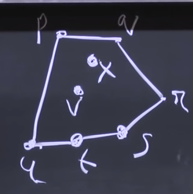

# Convex Hull
The minimum area or volume that encloses all points of a shape

Given n points in a plane
  S = {(xi, yi) | i = 1, 2, ... n}
assume no two have the same x-coord, no two have the same y-coord, no three in a line,
Convex Hull is the smallest convex polygon containing all points in S, referred to as CH(S)

CH(s) is the sequence of points on the boundary in clockwise order as doubly-linked list

==> p <==> q <==> r <==> s <==> t <==> u <==
^==========================================^

## Brute Force
Draw a line between any two points. If all points line on only one side of the line, that edge is part of the convex hull.

Complexity: O(n^3)

## Divide and Conquer
Sort the points by x-coord (only needed once)
For input set S, divide into left half "A" and right half "B" by x-coordinates
Compute CH(A) and CH(B)
Combine

Stopped @ 24:45
